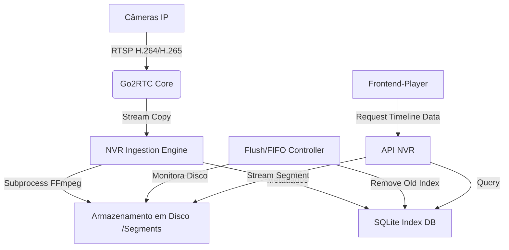

# Arquitetura do Módulo NVR Enterprise (Antigravity)

## 1. Visão Geral
O sistema opera em modelo **Híbrido de Gravação Segmentada**.
Em vez de gravar um único arquivo gigante (propenso a corrupção), gravamos "chunks" (segmentos) de 10 a 15 minutos. Isso facilita a purga (FIFO) e a busca (Seek).

## 2. Diagrama de Componentes

## 3. Estrutura de Classes (Backend)

### `NVREngine` (Controlador Principal)
- Inicializa o `StreamManager` e `StorageController`.
- Gerencia ciclo de vida da aplicação.

### `StreamIngestor` (Por Câmera)
- Responsável por manter o processo FFmpeg de gravação vivo.
- **Estratégia**: `ffmpeg -i rtsp://... -c copy -f segment -segment_time 600 -reset_timestamps 1 ...`
- Garante reconexão automática em caso de queda.

### `StorageController` (FIFO)
- **Thread em Background**: Roda a cada 1 minuto.
- Verifica uso do disco e idade dos arquivos.
- Executa: `DELETE FROM videos WHERE timestamp < (NOW - RetentionPeriod)` e apaga arquivos físicos.

### `TimelineAPI`
- Endpoint `/api/nvr/timeline?camera=x&start=A&end=B`
- Retorna JSON: `[{start: 1000, end: 1600, type: 'continuous'}, {start: 1200, end: 1210, type: 'motion'}]`

## 4. Estrutura de Tabelas (DB)

**Tabela `recordings`**
- `id` (PK)
- `camera_id` (Index)
- `file_path` (Path relativo)
- `start_time` (Unix Timestamp - Index)
- `end_time` (Unix Timestamp)
- `size_bytes`
- `duration`

**Tabela `events`** (Para Timeline colorida)
- `id`
- `camera_id`
- `event_type` ('motion', 'ai_human', 'line_cross')
- `timestamp`

## 5. Lógica de Frontend (Timeline)

**Timeline Visual (Canvas/HTML5)**
1. **Fetch**: Pede chunks para o viewport atual.
2. **Draw**: 
   - Retângulo Verde (Base) = `recordings`.
   - Retângulo Vermelho (Overlay) = `events`.
3. **Seek**: 
   - Ao clicar no tempo `T`:
   - Encontrar qual segmento contém `T`.
   - Calcular offset: `Offset = T - SegmentStart`.
   - Carregar vídeo: `src = segment_url + #t=Offset`.

**Sincronia Multi-Câmera**
- O "Mestre" é o relógio da timeline.
- Ao mudar o tempo master, emite evento `seek(T)` para todos os players ativos na grade.
